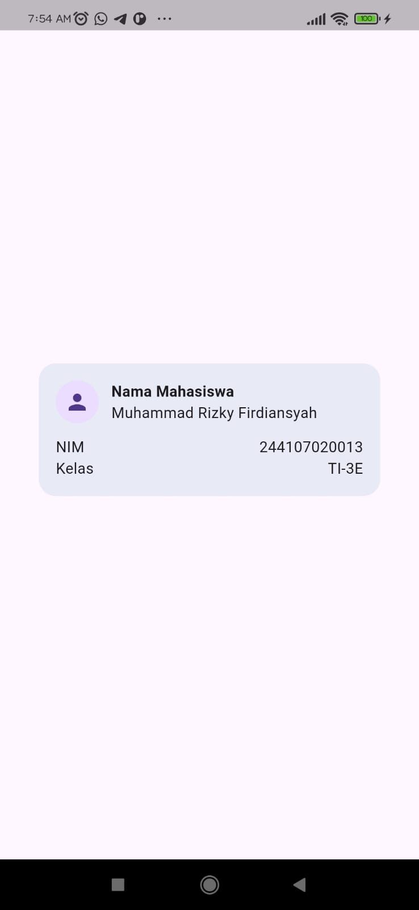
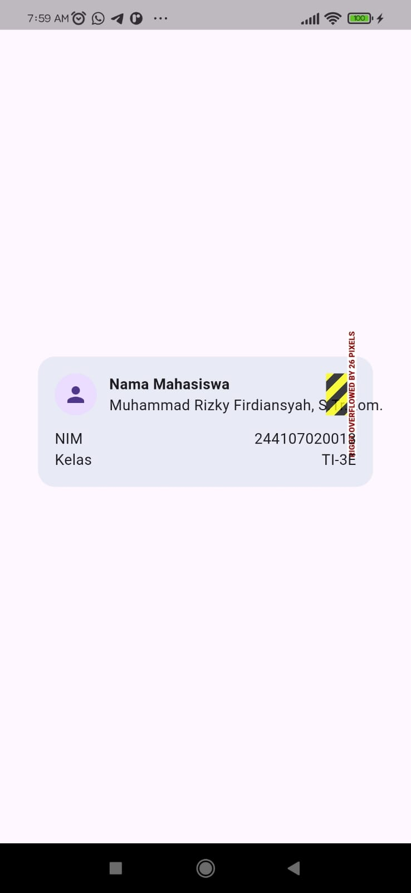
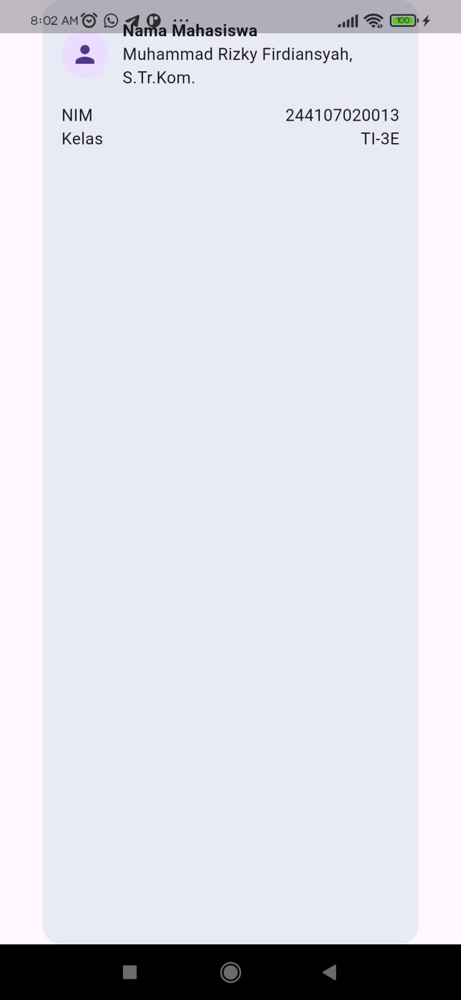
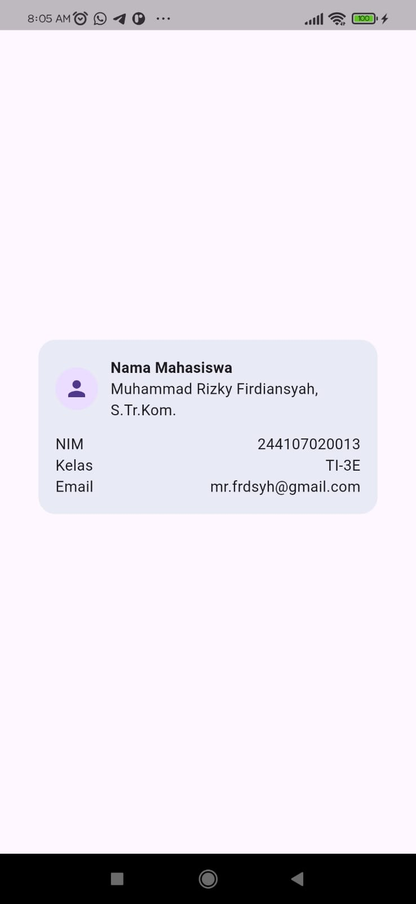
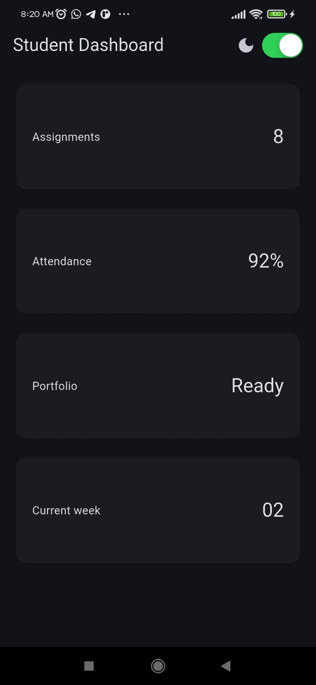
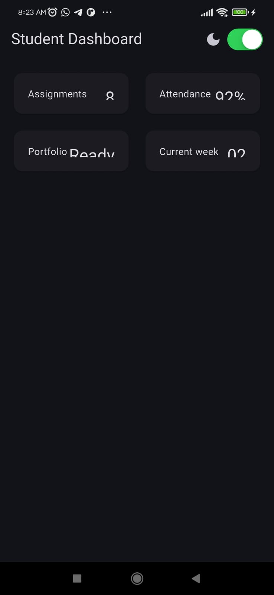
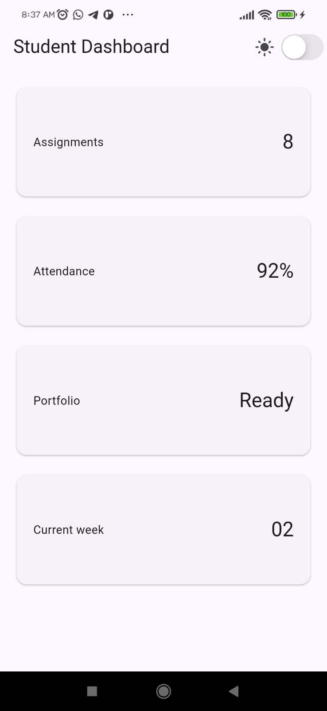
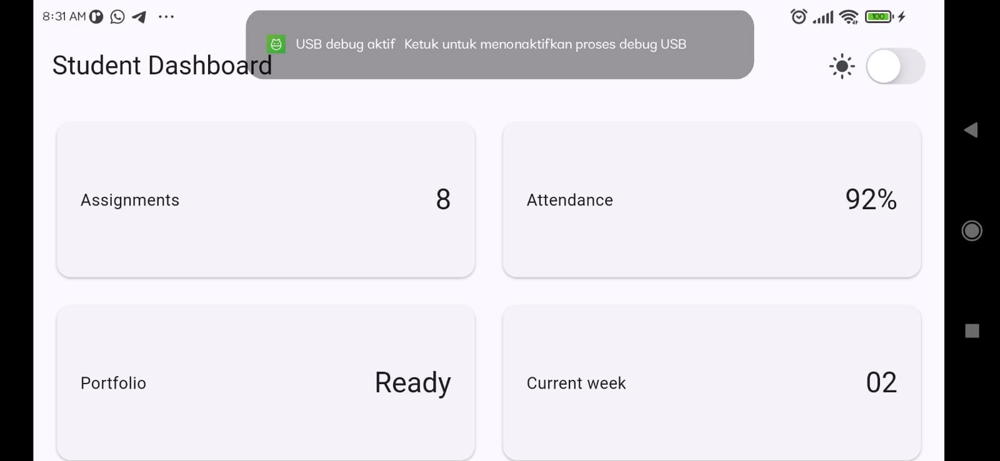
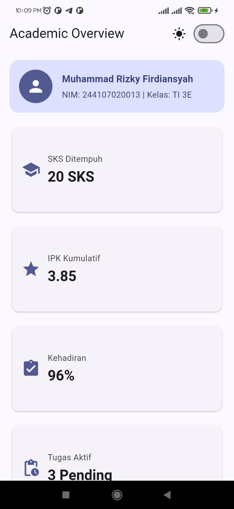
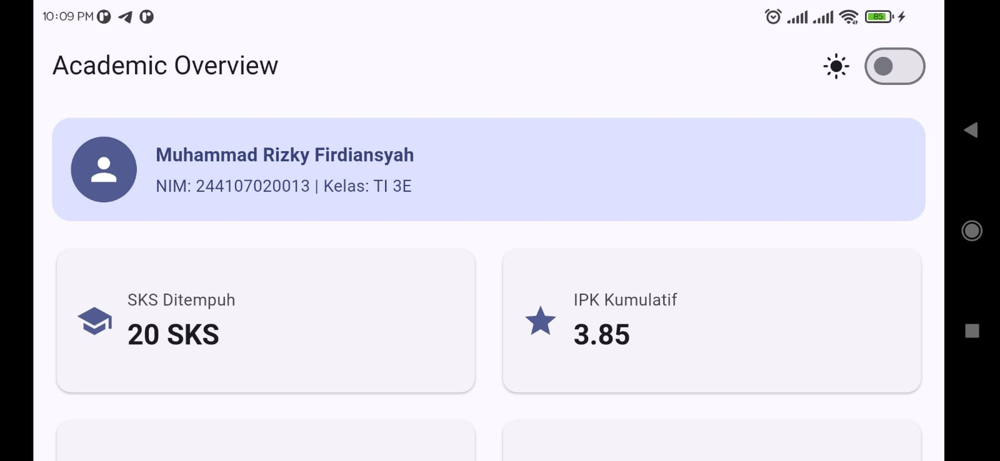

# 📱 Week 02 - Declarative UI & Responsive Design

Dokumentasi praktikum dan tugas minggu ke-2 mata kuliah Pemrograman Mobile. Repository ini berisi implementasi widget dasar, tata letak responsif menggunakan `LayoutBuilder`, penggunaan komponen Material dan Cupertino, refactoring widget reusable, AI prompt challenge, serta pengujian otomatis (_widget test_).

---

## 🎯 Tujuan

Memahami dan melatih penggunaan widget tata letak dasar (`Container`, `Column`, `Row`, `Expanded`, `CircleAvatar`) serta mengamati perilaku ukuran dimensi (_constraints_) dan _overflow_ sebelum membangun dashboard responsif.

---

## 🛠️ Stack Teknologi

- **Framework:** Flutter (Channel stable, v3.47.2)
- **Language:** Dart v3.13.2
- **UI Design System:** Material Design 3 & Cupertino (iOS-style)
- **Testing:** Flutter Test Framework

---

## 1. Praktikum: Layout Sederhana (Warm-up)

Praktikum ini membuat kartu profil sederhana (_ProfileCard_) pada file `lib/main.dart` menggunakan kombinasi `Container`, `Column`, dan `Row`.

### Kode Implementasi

```dart
import 'package:flutter/material.dart';

void main() => runApp(const ProfileApp());

class ProfileApp extends StatelessWidget {
  const ProfileApp({super.key});

  @override
  Widget build(BuildContext context) {
    return const MaterialApp(
      debugShowCheckedModeBanner: false,
      home: Scaffold(
        body: Center(child: ProfileCard()),
      ),
    );
  }
}

class ProfileCard extends StatelessWidget {
  const ProfileCard({super.key});

  @override
  Widget build(BuildContext context) {
    return Container(
      width: 320,
      padding: const EdgeInsets.all(16),
      decoration: BoxDecoration(
        color: Colors.indigo.shade50,
        borderRadius: BorderRadius.circular(16),
      ),
      child: Column(
        mainAxisSize: MainAxisSize.min,
        children: [
          Row(
            children: [
              const CircleAvatar(child: Icon(Icons.person)),
              const SizedBox(width: 12),
              Expanded(
                child: Column(
                  crossAxisAlignment: CrossAxisAlignment.start,
                  children: const [
                    Text(
                      'Nama Mahasiswa',
                      style: TextStyle(fontWeight: FontWeight.bold),
                    ),
                    Text('Muhammad Rizky Firdiansyah'),
                  ],
                ),
              ),
            ],
          ),
          const SizedBox(height: 12),
          const Row(
            children: [
              Expanded(child: Text('NIM')),
              Text('244107020013'),
            ],
          ),
          const SizedBox(height: 6),
          const Row(
            children: [
              Expanded(child: Text('Kelas')),
              Text('TI-3E'),
            ],
          ),
        ],
      ),
    );
  }
}
```



---

### Hasil Eksperimen Warm-up

1. **Eksperimen 1: Menghapus `Expanded` pada baris nama**
   - Widget `Expanded` berfungsi untuk mengisi sisa ruang horizontal yang tersedia di dalam `Row`.
   - Ketika `Expanded` dihapus, `Column` teks nama akan mengambil lebar menyesuaikan dengan lebar isi teks (child), sehingga teks nama yang panjang menyebabkan _layout overflow_.

   

2. **Eksperimen 2: Mengganti `mainAxisSize: MainAxisSize.min` ke nilai default (`MainAxisSize.max`)**
   - Secara default, nilai `mainAxisSize` pada `Column` adalah `MainAxisSize.max`.
   - Ketika `mainAxisSize` diubah menjadi `MainAxisSize.max` (atau dihapus), kartu profil akan memanjang vertikal mengambil seluruh ruang tinggi layar yang tersedia. Sebaliknya, `MainAxisSize.min` membuat tinggi kartu menyesuaikan dengan isi konten.

   

3. **Eksperimen 3: Menambahkan satu baris data (Email) dengan pola `Row` + `Expanded`**
   - Menambahkan baris email dengan pola `Row` + `Expanded(child: Text('Email'))` menghasilkan perataan yang konsisten: teks label `'Email'` mengambil ruang fleksibel di sisi kiri, dan nilai email berada di sisi kanan.
   - Selain itu, membungkus nilai email dengan `Flexible` dan `overflow: TextOverflow.ellipsis` mencegah teks panjang meluap (_overflow_) melewati batas lebar kontainer kartu.

   

---

## 3. Praktikum: Dashboard Responsif

Praktikum ini membuat antarmuka dashboard responsif menggunakan widget `LayoutBuilder`, `GridView.count`, dan kartu metrik `DashboardCard`.

### 1. Implementasi Awal: StatelessWidget & LayoutBuilder

Pada tahap awal, `DashboardApp` dibangun sebagai `StatelessWidget`. Widget `LayoutBuilder` digunakan untuk membaca batasan lebar layar (`constraints.maxWidth`). Jika lebar layar mencapai atau melebihi 700 piksel (`maxWidth >= 700`), grid menampilkan 2 kolom; jika kurang dari 700 piksel, grid beralih otomatis menjadi 1 kolom.

```dart
import 'package:flutter/material.dart';

void main() => runApp(const DashboardApp());

class DashboardApp extends StatelessWidget {
  const DashboardApp({super.key});

  @override
  Widget build(BuildContext context) {
    return MaterialApp(
      debugShowCheckedModeBanner: false,
      theme: ThemeData(useMaterial3: true, colorSchemeSeed: Colors.indigo),
      darkTheme: ThemeData(
        useMaterial3: true,
        brightness: Brightness.dark,
        colorSchemeSeed: Colors.indigo,
      ),
      themeMode: ThemeMode.system,
      home: const DashboardPage(),
    );
  }
}

class DashboardPage extends StatelessWidget {
  const DashboardPage({super.key});

  @override
  Widget build(BuildContext context) {
    return Scaffold(
      appBar: AppBar(title: const Text('Student Dashboard')),
      body: LayoutBuilder(
        builder: (context, constraints) {
          final columns = constraints.maxWidth >= 700 ? 2 : 1;
          return GridView.count(
            padding: const EdgeInsets.all(16),
            crossAxisCount: columns,
            crossAxisSpacing: 16,
            mainAxisSpacing: 16,
            childAspectRatio: 2.6,
            children: const [
              DashboardCard(title: 'Assignments', value: '8'),
              DashboardCard(title: 'Attendance', value: '92%'),
              DashboardCard(title: 'Portfolio', value: 'Ready'),
              DashboardCard(title: 'Current week', value: '02'),
            ],
          );
        },
      ),
    );
  }
}

class DashboardCard extends StatelessWidget {
  const DashboardCard({required this.title, required this.value, super.key});
  final String title;
  final String value;

  @override
  Widget build(BuildContext context) {
    return Card(
      child: Padding(
        padding: const EdgeInsets.all(20),
        child: Row(
          children: [
            Expanded(child: Text(title)),
            Text(value, style: Theme.of(context).textTheme.headlineSmall),
          ],
        ),
      ),
    );
  }
}
```

---

### 2. Menambahkan Interaksi: StatefulWidget dan Cupertino

Aplikasi ditingkatkan menjadi `StatefulWidget` untuk menambahkan fitur interaktif pergantian tema terang dan gelap secara manual melalui komponen `CupertinoSwitch` pada `AppBar`.

```dart
import 'package:flutter/cupertino.dart';
import 'package:flutter/material.dart';

void main() => runApp(const DashboardApp());

class DashboardApp extends StatefulWidget {
  const DashboardApp({super.key});

  @override
  State<DashboardApp> createState() => _DashboardAppState();
}

class _DashboardAppState extends State<DashboardApp> {
  bool isDark = false;

  @override
  Widget build(BuildContext context) {
    return MaterialApp(
      debugShowCheckedModeBanner: false,
      theme: ThemeData(useMaterial3: true, colorSchemeSeed: Colors.indigo),
      darkTheme: ThemeData(
        useMaterial3: true,
        brightness: Brightness.dark,
        colorSchemeSeed: Colors.indigo,
      ),
      themeMode: isDark ? ThemeMode.dark : ThemeMode.light,
      home: DashboardPage(
        isDark: isDark,
        onDarkChanged: (value) => setState(() => isDark = value),
      ),
    );
  }
}

class DashboardPage extends StatelessWidget {
  const DashboardPage({
    required this.isDark,
    required this.onDarkChanged,
    super.key,
  });
  final bool isDark;
  final ValueChanged<bool> onDarkChanged;

  @override
  Widget build(BuildContext context) {
    return Scaffold(
      appBar: AppBar(
        title: const Text('Student Dashboard'),
        actions: [
          Row(
            children: [
              Icon(isDark ? Icons.dark_mode : Icons.light_mode),
              const SizedBox(width: 4),
              CupertinoSwitch(
                value: isDark,
                onChanged: onDarkChanged,
              ),
              const SizedBox(width: 12),
            ],
          ),
        ],
      ),
      body: LayoutBuilder(
        builder: (context, constraints) {
          final columns = constraints.maxWidth >= 700 ? 2 : 1;
          return GridView.count(
            padding: const EdgeInsets.all(16),
            crossAxisCount: columns,
            crossAxisSpacing: 16,
            mainAxisSpacing: 16,
            childAspectRatio: 2.6,
            children: const [
              DashboardCard(title: 'Assignments', value: '8'),
              DashboardCard(title: 'Attendance', value: '92%'),
              DashboardCard(title: 'Portfolio', value: 'Ready'),
              DashboardCard(title: 'Current week', value: '02'),
            ],
          );
        },
      ),
    );
  }
}

class DashboardCard extends StatelessWidget {
  const DashboardCard({required this.title, required this.value, super.key});
  final String title;
  final String value;

  @override
  Widget build(BuildContext context) {
    return Card(
      child: Padding(
        padding: const EdgeInsets.all(20),
        child: Row(
          children: [
            Expanded(child: Text(title)),
            Text(value, style: Theme.of(context).textTheme.headlineSmall),
          ],
        ),
      ),
    );
  }
}
```

---

### Hasil Eksperimen Layout & Interaksi

1. **Eksperimen 1: Perubahan Breakpoint Layar**
   - Nilai breakpoint `constraints.maxWidth >= 700` menentukan responsivitas tampilan: layar sempit (kurang dari 700) akan menampilkan 1 kolom, sedangkan layar lebar (lebih dari 700) akan menampilkan 2 kolom.
   - Mengubah nilai breakpoint ini menggeser batas kapan layout grid bertransisi secara dinamis.

   
   

2. **Eksperimen 2: Perubahan ThemeMode & Penggunaan CupertinoSwitch**
   - Komponen `CupertinoSwitch` dari package Cupertino terdapat toggle dengan style iOS.
   - Perubahan state `isDark` mengubah properti `themeMode` secara state antara `ThemeMode.dark` dan `ThemeMode.light`.

3. **Eksperimen 3: Pengujian Ukuran Layar Berbeda**
   - Saat dijalankan pada emulator dengan orientasi atau resolusi yang berbeda, `LayoutBuilder` membaca batasan ruang secara langsung dan menyesuaikan layout kartu dashboard berdasarkan screen.

   
   

4. **Eksperimen 4: Aksesibilitas Elemen UI**
   - Elemen interaktif seperti toggle dark & light mode pada dashboard dapat dilengkapi label agar mudah dikenali oleh fitur aksesibilitas.

---

## 4. Tugas Utama: Academic Overview

Pada tugas utama ini, dashboard dikembangkan menjadi halaman **Academic Overview** lengkap yang memenuhi semua kriteria:

1. **Header Profil Mahasiswa**:
   - Menampilkan `CircleAvatar` profil, nama mahasiswa, serta informasi akademik.
2. **Empat Kartu Informasi Akademik**:
   - Menampilkan metrik akademik
3. **Pemanfaatan Widget Inti**:
   - Menggunakan `Row`, `Column`, `Expanded`, `Container`, dan `Card`.
4. **Responsivitas Layar (Breakpoints)**:
   - Menggunakan konstanta.
   - Menampilkan **1 kolom** pada layar sempit (`constraints.maxWidth < 700`).
   - Menampilkan **2 kolom** pada layar lebar (`constraints.maxWidth >= 700`).
5. **Dukungan Light & Dark Theme**:
   - Menggunakan `MaterialApp` dengan `theme` dan `darkTheme`.
   - Menggunakan `CupertinoSwitch` di `AppBar` untuk mengubah tema.
6. **Aksesibilitas (Accessibility / Semantics)**:
   - Membungkus toggle tema dengan `Semantics(label: 'Toggle mode gelap')`.
   - Membungkus setiap kartu metrik dengan `Semantics(label: '$title: $value')`.

### Source Code Final (`lib/main.dart`)

```dart
import 'package:flutter/cupertino.dart';
import 'package:flutter/material.dart';

void main() => runApp(const DashboardApp());

const kWideBreakpoint = 700;

class DashboardApp extends StatefulWidget {
  const DashboardApp({super.key});

  @override
  State<DashboardApp> createState() => _DashboardAppState();
}

class _DashboardAppState extends State<DashboardApp> {
  bool isDark = false;

  @override
  Widget build(BuildContext context) {
    return MaterialApp(
      debugShowCheckedModeBanner: false,
      title: 'Academic Overview',
      theme: ThemeData(
        useMaterial3: true,
        colorSchemeSeed: Colors.indigo,
        brightness: Brightness.light,
      ),
      darkTheme: ThemeData(
        useMaterial3: true,
        colorSchemeSeed: Colors.indigo,
        brightness: Brightness.dark,
      ),
      themeMode: isDark ? ThemeMode.dark : ThemeMode.light,
      home: DashboardPage(
        isDark: isDark,
        onDarkChanged: (value) => setState(() => isDark = value),
      ),
    );
  }
}

class DashboardPage extends StatelessWidget {
  const DashboardPage({
    required this.isDark,
    required this.onDarkChanged,
    super.key,
  });
  final bool isDark;
  final ValueChanged<bool> onDarkChanged;

  @override
  Widget build(BuildContext context) {
    final theme = Theme.of(context);

    return Scaffold(
      appBar: AppBar(
        title: const Text('Academic Overview'),
        actions: [
          Row(
            children: [
              Icon(
                isDark ? Icons.dark_mode : Icons.light_mode,
                color: theme.colorScheme.onSurface,
              ),
              const SizedBox(width: 8),
              Semantics(
                label: 'Toggle Dark Mode',
                hint: 'Mengubah tema aplikasi antara terang dan gelap',
                toggled: isDark,
                child: Switch.adaptive(value: isDark, onChanged: onDarkChanged),
              ),
              const SizedBox(width: 12),
            ],
          ),
        ],
      ),
      body: SingleChildScrollView(
        padding: const EdgeInsets.all(16),
        child: Column(
          crossAxisAlignment: CrossAxisAlignment.start,
          children: [
            // Header Profil Mahasiswa
            const ProfileHeader(),
            const SizedBox(height: 20),

            // Grid Responsif Kartu Informasi Academic
            LayoutBuilder(
              builder: (context, constraints) {
                final isWide = constraints.maxWidth >= kWideBreakpoint;
                final columns = isWide ? 2 : 1;

                return GridView.count(
                  shrinkWrap: true,
                  physics: const NeverScrollableScrollPhysics(),
                  crossAxisCount: columns,
                  crossAxisSpacing: 16,
                  mainAxisSpacing: 16,
                  childAspectRatio: isWide ? 2.8 : 2.4,
                  children: const [
                    InfoCard(
                      title: 'SKS Ditempuh',
                      value: '20 SKS',
                      icon: Icons.school,
                    ),
                    InfoCard(
                      title: 'IPK Kumulatif',
                      value: '3.85',
                      icon: Icons.grade,
                    ),
                    InfoCard(
                      title: 'Kehadiran',
                      value: '96%',
                      icon: Icons.assignment_turned_in,
                    ),
                    InfoCard(
                      title: 'Tugas Aktif',
                      value: '3 Pending',
                      icon: Icons.pending_actions,
                    ),
                  ],
                );
              },
            ),
          ],
        ),
      ),
    );
  }
}

class ProfileHeader extends StatelessWidget {
  const ProfileHeader({super.key});

  @override
  Widget build(BuildContext context) {
    final theme = Theme.of(context);

    return Semantics(
      label: 'Informasi Profil Mahasiswa',
      container: true,
      child: Container(
        padding: const EdgeInsets.all(16),
        decoration: BoxDecoration(
          color: theme.colorScheme.primaryContainer,
          borderRadius: BorderRadius.circular(16),
        ),
        child: Row(
          children: [
            CircleAvatar(
              radius: 28,
              backgroundColor: theme.colorScheme.primary,
              child: Icon(
                Icons.person,
                color: theme.colorScheme.onPrimary,
                size: 32,
              ),
            ),
            const SizedBox(width: 16),
            Expanded(
              child: Column(
                crossAxisAlignment: CrossAxisAlignment.start,
                children: [
                  Text(
                    'Muhammad Rizky Firdiansyah',
                    style: theme.textTheme.titleMedium?.copyWith(
                      fontWeight: FontWeight.bold,
                      color: theme.colorScheme.onPrimaryContainer,
                    ),
                  ),
                  const SizedBox(height: 4),
                  Text(
                    'NIM: 244107020013 | Kelas: TI 3E',
                    style: theme.textTheme.bodyMedium?.copyWith(
                      color: theme.colorScheme.onPrimaryContainer,
                    ),
                  ),
                ],
              ),
            ),
          ],
        ),
      ),
    );
  }
}

class InfoCard extends StatelessWidget {
  const InfoCard({
    required this.title,
    required this.value,
    required this.icon,
    super.key,
  });

  final String title;
  final String value;
  final IconData icon;

  @override
  Widget build(BuildContext context) {
    final theme = Theme.of(context);

    return Semantics(
      label: '$title: $value',
      container: true,
      child: Card(
        elevation: 1,
        shape: RoundedRectangleBorder(borderRadius: BorderRadius.circular(12)),
        child: Padding(
          padding: const EdgeInsets.all(16),
          child: Row(
            children: [
              Icon(icon, size: 32, color: theme.colorScheme.primary),
              const SizedBox(width: 12),
              Expanded(
                child: Column(
                  mainAxisAlignment: MainAxisAlignment.center,
                  crossAxisAlignment: CrossAxisAlignment.start,
                  children: [
                    Text(
                      title,
                      style: theme.textTheme.bodyMedium?.copyWith(
                        color: theme.colorScheme.onSurfaceVariant,
                      ),
                    ),
                    const SizedBox(height: 4),
                    Text(
                      value,
                      style: theme.textTheme.headlineSmall?.copyWith(
                        fontWeight: FontWeight.bold,
                        color: theme.colorScheme.onSurface,
                      ),
                    ),
                  ],
                ),
              ),
            ],
          ),
        ),
      ),
    );
  }
}
```

### Hasil Tampilan Academic Overview

1. **Layar Sempit (< 700px, 1 Kolom)**:
   - Seluruh kartu informasi tersusun vertikal dalam 1 kolom dengan rasio yang nyaman dibaca pada perangkat smartphone.

   

2. **Layar Lebar (>= 700px, 2 Kolom)**:
   - Kartu informasi bertransisi secara otomatis menjadi layout grid 2 kolom pada layar tablet / desktop / landscape.

   

### Tantangan Refactoring yang Diselesaikan

1. **Refactor Widget Reusable**:
   - Kartu metrik disendirikan menjadi komponen independen `InfoCard` dengan parameter `title` dan `value`, menyederhanakan widget tree serta menghilangkan duplikasi kode (reduntant).
2. **Standardisasi Tipografi & Warna**:
   - Menggantikan hardcoded style dengan `Theme.of(context).textTheme` (`titleLarge`, `titleMedium`, `headlineSmall`) dan `Theme.of(context).colorScheme` (`primary`, `primaryContainer`, `onPrimary`) sehingga adaptasi tema light dan dark berjalan konsisten.
3. **Konstanta Breakpoint Terisolasi**:
   - Mendeklarasikan `const double kWideBreakpoint = 700;` di bagian atas agar mudah dikelola dan mudah ditemukan.

### Pengujian (Responsive Widget Test)

Pengujian diimplementasikan pada `test/widget_test.dart` menggunakan `tester.view.physicalSize` dan `tester.view.devicePixelRatio`:

Hasil eksekusi `flutter test`:

- Hasil Test: [11-test-results.png](./screenshots/11-test-results.png)

---

## 5. AI Prompt Challenge & Design Exploration

### Challenge 1: Prompt Desain

1. **Prompt**:

   > _"Bandingkan dua tata letak dashboard akademik untuk Flutter: versi GridView dan versi LayoutBuilder + Column. Jelaskan trade-off responsif dan aksesibilitasnya."_

2. **Respons**:
   - `GridView`: Ideal untuk elemen kartu berukuran seragam. Pembagian kolom dinamis sangat mudah disesuaikan via crossAxisCount.
   - `LayoutBuilder + Column`: Memberikan kontrol lebih besar jika terdapat elemen dengan ukuran tidak rata (seperti profil header) di dalam alur layout..

---

### Challenge 2: Prompt Penguatan Konsep

1. **Prompt**:

   > _"Jelaskan kapan penggunaan Expanded justru menyebabkan overflow di dalam Row, beri contoh kode yang gagal dan perbaikannya."_

2. **Respons**:
   - Expanded membutuhkan ruang yang terbatas (constrained width). Jika ditaruh di dalam Row yang berada di dalam SingleChildScrollView horizontal, Flutter akan melempar error unbounded constraints.
   - **Contoh Kode Gagal**:
     ```dart
      SingleChildScrollView(
        scrollDirection: Axis.horizontal,
        child: Row(
        children: [
          Expanded(child: Text('Teks Panjang')), // Error Unbounded Width
          ],
        ),
      )
     ```
   - **Contoh Kode Perbaikan**:
     ```dart
      SingleChildScrollView(
        scrollDirection: Axis.horizontal,
        child: Row(
          children: [
          //  Expanded dihapus, lebar akan otomatis menyesuaikan isi teks
          Text('Teks Panjang'),
          ],
        ),
      )
     ```
---

### Challenge 3: Verification Prompt (Audit AI Mandiri)

1. **Prompt**:

   > _"Periksa kembali rekomendasi layout di atas: apakah tetap responsif di bawah 600px, apakah mengurangi aksesibilitas, dan apakah ada widget yang tidak tersedia di Flutter stabil saat ini?"_

2. **Respons**:
   - Responsivitas (< 600px): Teruji aman karena saat lebar layar < 700px, layout otomatis jatuh menjadi 1 kolom.
   - Aksesibilitas: Komponen utama telah terbungkus Semantics (label, hint, toggled).
   - Kestabilan Widget: Semua widget (Switch.adaptive, LayoutBuilder, Semantics, Material3 Theme) menggunakan SDK Flutter Stable resmi.

---

## 6. Refleksi Pembelajaran (Reflections)

1. **Perbedaan Cara Berpikir Imperative dan Declarative saat Membangun UI**:
   Dalam paradigma imperative (seperti Android XML/Java standar), developer mengubah UI secara manual langkah demi langkah saat terjadi event (setText(), setVisibility()). Sedangkan dalam paradigma declarative (seperti Flutter), UI dirancang sebagai cerminan dari state (UI = f(state)). Ketika state berubah, Flutter secara otomatis membangun kembali (rebuild) widget tree yang relevan.

2. **Kapan Expanded Membantu dan Kapan Menghasilkan Layout Error**:
   Expanded sangat membantu ketika kita ingin widget fleksibel mengisi sisa ruang kosong pada Row atau Column. Namun, Expanded akan menghasilkan layout error (unbounded constraints) jika diletakkan di dalam widget yang memberikan ruang tak terbatas, seperti di dalam SingleChildScrollView dengan arah scroll yang sejajar.

3. **Pengaruh Breakpoint dan Theme terhadap Pengalaman Pengguna (UX)**:
   Breakpoint memastikan tata letak aplikasi tetap nyaman dipandang dan mudah diinteraksi baik pada perangkat layar kecil (smartphone) maupun layar besar (tablet/desktop) tanpa elemen yang terpotong. Pengaturan theme (Light/Dark Mode) yang konsisten meningkatkan aksesibilitas dan kenyamanan visual pengguna dalam berbagai kondisi pencahayaan.

4. **Hal yang Diverifikasi dari Rekomendasi AI setelah Tugas Inti Selesai**:
   Memastikan bahwa saran AI tidak menggunakan widget deprecated, kode mematuhi kaidah flutter analyze, tata letak tetap stabil pada layar di bawah 600px, serta widget Semantics terpasang dengan benar tanpa merusak fungsionalitas UI.

---

## 7. Jurnal Belajar (Learning Journal)

### Ringkasan Teknis

- **Widget Tree Composition**: Menggabungkan `Scaffold`, `AppBar`, `LayoutBuilder`, `Column`, `Container`, `Expanded`, `Card`, dan `GridView.count` untuk menyusun tata letak _Academic Overview_.
- **Responsive Layout**: Menggunakan konstanta breakpoint `const double kWideBreakpoint = 700;` untuk mengatur jumlah kolom `GridView.count` secara dinamis (1 kolom vertikal vs 2 kolom grid).
- **Theme Switching**: Menerapkan Material 3 `ThemeData` dengan `colorSchemeSeed: Colors.indigo`, mendukung transisi dinamis antara `ThemeMode.light` dan `ThemeMode.dark` melalui `CupertinoSwitch`.
- **Aksesibilitas (Semantics)**: Membungkus switch tema dan kartu metrik dengan widget `Semantics` agar mudah diakses oleh pembaca layar.
- **Automated Testing**: Menulis widget test responsif dengan memanipulasi ukuran layar virtual menggunakan `tester.view.physicalSize` dan `tester.view.devicePixelRatio`.

## 8. Kesimpulan

Praktikum Minggu ke-2 berhasil menyelesaikan implementasi UI deklaratif dan responsive design:

- Memahami konsep widget dasar layout (`Row`, `Column`, `Expanded`, `Container`) dan penanganan overflow constraint melalui latihan profil warm-up.
- Mengimplementasikan dashboard responsif menggunakan `LayoutBuilder` dengan breakpoint adaptif.
- Membangun halaman **Academic Overview** lengkap dengan header profil mahasiswa, 4 kartu metrik akademik, switch tema terang/gelap, dan label aksesibilitas `Semantics`.
- Menyelesaikan tantangan refactoring dan audit pengujian otomatis responsif (`flutter test`) hingga lulus 100%.
